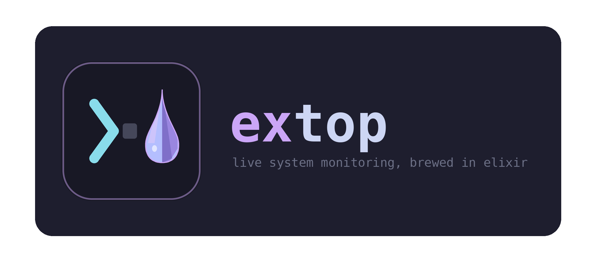

<p align="center">
  
</p>

<p align="center">
  A system monitor for Linux, built in Elixir with <a href="https://hex.pm/packages/ex_ratatui">ex_ratatui</a>.
</p>

<p align="center">
  Catppuccin Macchiato theme · live CPU/GPU/memory charts · process management · BEAM runtime stats
</p>

---

## Features

- **Dashboard** - CPU cores, memory/swap/disk gauges, GPU usage (NVIDIA, AMD, Intel), and live charts
- **Processes** - sortable table, name/user/PID filter, send signals (TERM, KILL, STOP, CONT, HUP, INT)
- **Network** - per-interface throughput and history graph
- **System** - native host info (OS, kernel, desktop, battery, IPs, …) plus live BEAM/OTP runtime metrics

## Requirements

### Running a release

- Linux with `/proc` and `/sys` (tested on Ubuntu)
- A terminal with true-color support

A compiled release is self-contained — you do not need Elixir or Erlang installed to run it.

### Building from source

- **Elixir** 1.19+ (see `mix.exs`)
- **Erlang/OTP** — OTP 29 is recommended. On Elixir 1.20.2, extop starts and exits noticeably faster on OTP 29 than on OTP 28.

Optional: `gsettings` for GTK theme details on the System tab.

## Development

```bash
git clone <repo-url>
cd extop
mix deps.get
mix run
```

Press `q` or `Esc` to quit.

## Install

Build a standalone release:

```bash
MIX_ENV=prod mix release
```

Run it directly - no `start` subcommand needed:

```bash
./_build/prod/rel/extop/bin/extop
```

Copy `_build/prod/rel/extop` anywhere and run `bin/extop` from that directory.

Add the release `bin` directory to your `PATH` to run `extop` from anywhere:

```bash
export PATH="/path/to/extop/_build/prod/rel/extop/bin:$PATH"
extop
```

For a permanent setup, add that line to `~/.bashrc`, `~/.zshrc`, or your shell profile.

Release management commands still work when passed explicitly:

```bash
./bin/extop stop
./bin/extop remote
./bin/extop version
```

## Keybindings

| Key | Action |
|-----|--------|
| `1`–`4` / `Tab` | Switch tabs |
| `q` / `Esc` | Quit |
| `↑` `↓` `j` | Scroll / select process |
| `/` | Filter processes |
| `p` `u` `n` `c` `m` | Sort by PID / user / name / CPU / mem |
| `t` `k` `s` `r` `h` `i` | Send signal to selected process |
| `r` | Refresh System tab info |

## License

See [LICENSE](LICENSE) if present.
